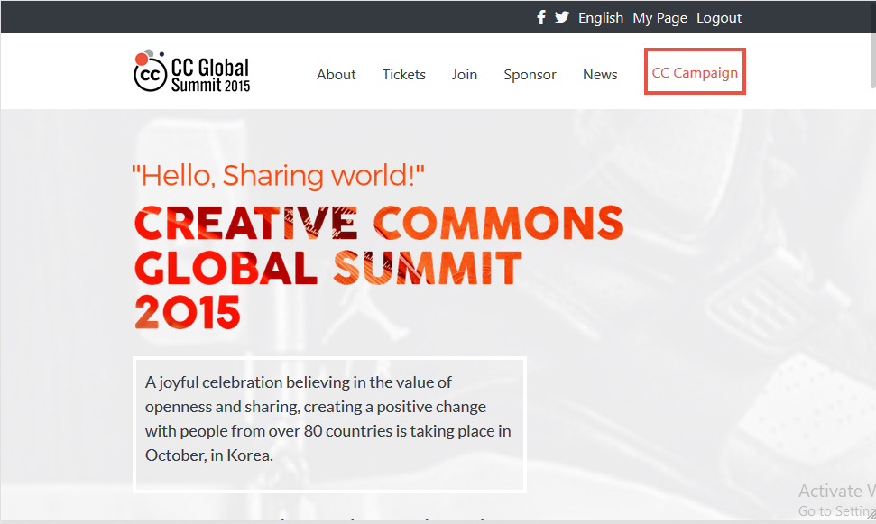
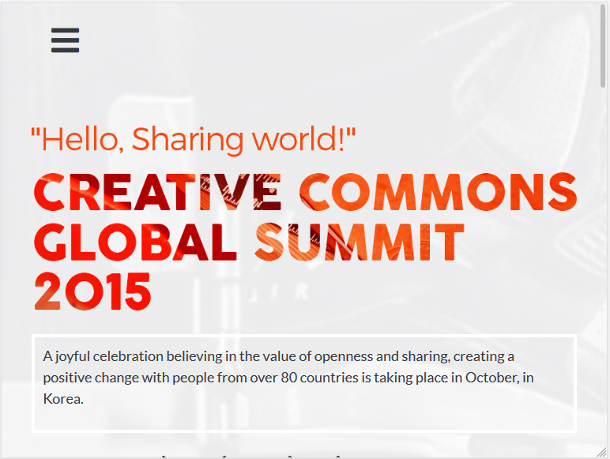
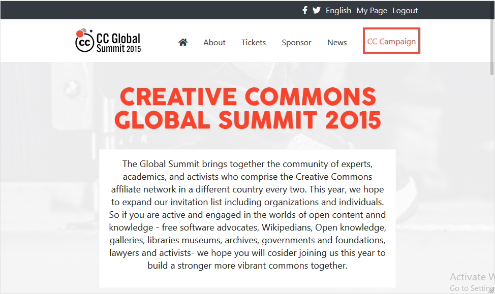
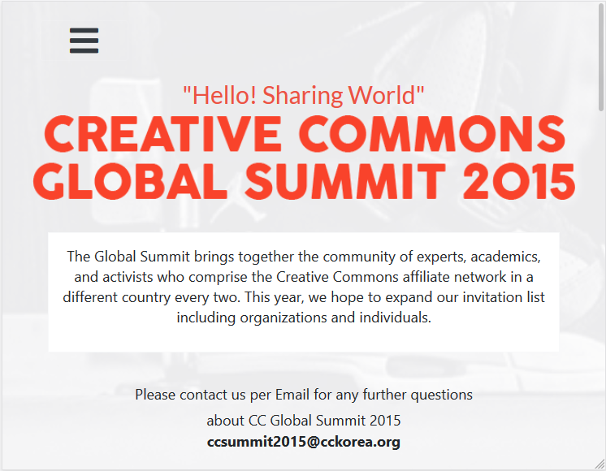
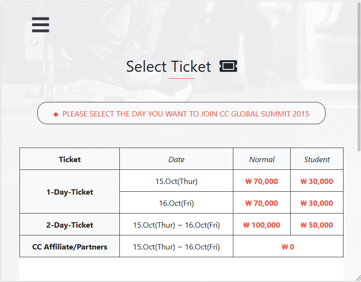

# Microverse Capstone Project
The aim of this project is putting the student in a real life situation where they are given a real-world-like project with specifications and a time duration to convert those specifications into a functional product.
 
My project was to replicate the Creative Commons 2015 Global Summit Conference site. I was tasked to build the a minimum of 3 pages at two different screen sizes :
- Mobile up to 768px
- Desktop from 768px and bigger.

## Screenshots for various screen sizes
 

  &nbsp; 

 

 &nbsp; 
 

 
 

 &nbsp; 
 

 

## Built With

* Html
* Css
* Bootstrap

## Video Link

[Video Explanation Link](https://youtu.be/XuFRXxsYnOo)

## Author

👤 **Osong Agberndifor**

- Github: [Osong Agberndifor](https://github.com/OA7)
- Twitter: [Osong Agberndifor](https://twitter.com/Osong17)
- Linkedin: [Osong Agberndifor](https://linkedin.com/osong-agberndifor)

## 🤝 Contributing

Contributions, issues and feature requests are welcome!

Feel free to check the [Issues page](https://github.com/OA7/Creative-Commons-Page/issues).

## Show your support

Give a ⭐️ if you like this project!

## Acknowledgements
  * [Microverse](https://www.microverse.org/)
  * The original designer of the UI for this website is [Cindy Shin](https://www.behance.net/adagio07)

## License
 Distributed under the [Creative Commons License](https://creativecommons.org/licenses/by-nc/4.0/)